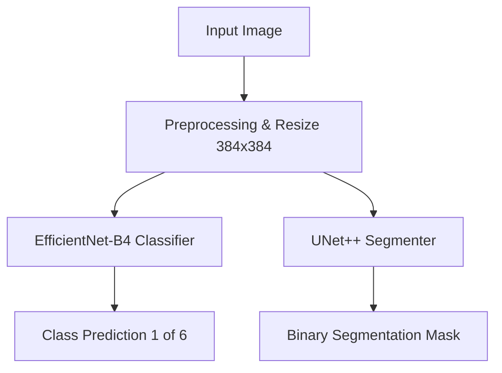

# Technical Report
# GLOF Challenge Validation Phase Technical Report
This technical report documents the dataset, pipeline architecture, training details, optimization strategy, evaluation results, and failure mode analysis for the validation phase of the **Glacial Lake Outburst Flood (GLOF)** detection challenge.
---
## 1. Dataset Characteristics
The validation phase dataset comprises **2220 matched image-mask pairs** with zero mismatches. The instances are distributed across 6 categories representing different weather, terrain, and turbidity conditions.
| Category (Test Name) | Category (Train Name) | Images | Masks | Percentage |
| :--- | :--- | :---: | :---: | :---: |
| Cloud Cover | Cloud Cover | 12 | 12 | 0.54% |
| Debris Cover | Debris Cover | 234 | 234 | 10.54% |
| Moraine Dammed | Moraine | 835 | 835 | 37.61% |
| Snow Cover | Snow Cover | 834 | 834 | 37.57% |
| Terrain Shadow | Terraine Shadow | 239 | 239 | 10.77% |
| Varying Turbidity | Turbidity | 66 | 66 | 2.97% |
| **TOTAL** | | **2220** | **2220** | **100%** |
*Note: The dataset exhibits severe class imbalance, with Moraine Dammed and Snow Cover representing ~75% of the total dataset, whereas Cloud Cover and Varying Turbidity are highly underrepresented.*
---
## 2. Pipeline & Model Architecture
The GLOF detection pipeline is structured as a dual-model, multi-task learning workflow consisting of a classifier and a segmenter.

### 2.1 Image-Level Classifier
* **Backbone:** Pretrained `EfficientNet-B4` (loaded via the `timm` library).
* **Target Classes:** 6 categories mapping the terrain classification.
* **Loss Function:** CrossEntropyLoss with **label smoothing = 0.1** to prevent overfitting on noisy labels and extreme class imbalances.
* **Epochs:** 10 epochs.
### 2.2 Pixel-Level Segmenter
* **Architecture:** `UNet++` with dense nested skip connections (via `segmentation_models_pytorch`).
* **Encoder Backbone:** Pretrained `efficientnet-b4` (ImageNet initialization).
* **Output:** Single-channel logit for binary segmentation (lake vs. background).
* **Loss Function:** Hybrid **Focal Loss + Tversky Loss (50/50)**.
  * *Focal Loss* handles severe spatial class imbalance (lakes occupy small fractions of the image).
  * *Tversky Loss* (parameters: $\alpha=0.65$, $\beta=0.35$) penalizes false positives more heavily to reduce lake hallucinations on shadows or rocks.
* **Epochs:** 10 epochs.
### 2.3 Image Preprocessing & Augmentations
Images and masks are resized to $384 \times 384$ pixels. 
* **Training Augmentations:** `HorizontalFlip` (p=0.5), `VerticalFlip` (p=0.5), `ShiftScaleRotate` (p=0.5), `ColorJitter` (brightness/contrast, p=0.3), and standard normalization.
* **Inference/Validation Preprocessing:** Resizing and standard normalization.
---
## 3. Evaluation Results
The models were evaluated on a stratified $20\%$ validation split ($444$ image-mask pairs).
### 3.1 Classification Metrics
* **Accuracy:** 0.5991
* **Precision (Macro):** 0.4103
* **Recall (Macro):** 0.3648
* **F1 Score (Macro):** 0.3760
* **F1 Score (Weighted):** 0.5842
* **Cohen's Kappa:** 0.4012
#### Per-Class Classification Report
| Category | Precision | Recall | F1-Score | Support |
| :--- | :---: | :---: | :---: | :---: |
| Cloud Cover | 0.00 | 0.00 | 0.00 | 2 |
| Debris Cover | 0.52 | 0.28 | 0.36 | 47 |
| Moraine | 0.60 | 0.64 | 0.62 | 167 |
| Snow Cover | 0.64 | 0.74 | 0.69 | 167 |
| Terraine Shadow | 0.50 | 0.46 | 0.48 | 48 |
| Turbidity | 0.20 | 0.08 | 0.11 | 13 |
### 3.2 Segmentation Metrics (Overall)
* **Mean IoU:** 0.6260
* **Precision:** 0.7656
* **Recall:** 0.6697
* **F1 Score:** 0.6920
* **Cohen's Kappa:** 0.6954
### 3.3 Per-Category Segmentation Metrics
| Category | Mean IoU | Precision | Recall | F1-Score | Kappa |
| :--- | :---: | :---: | :---: | :---: | :---: |
| **Cloud Cover** | **0.8841** | 0.9822 | 0.8985 | 0.9385 | 0.9571 |
| **Varying Turbidity** | **0.7455** | 0.8214 | 0.8319 | 0.8227 | 0.8117 |
| **Terrain Shadow** | **0.6429** | 0.7797 | 0.6821 | 0.7085 | 0.7160 |
| **Snow Cover** | **0.6379** | 0.7708 | 0.6651 | 0.6990 | 0.7107 |
| **Moraine Dammed** | **0.6132** | 0.7391 | 0.6682 | 0.6789 | 0.6768 |
| **Debris Cover** | **0.5677** | 0.8025 | 0.6235 | 0.6505 | 0.6428 |
---
## 4. Key Performance Insights
### 4.1 Why Cloud Cover Performs Well (IoU: 0.8841)
* **High Contrast Boundaries:** Clouds and snow-free lakes have stark visual differences. The bright, high-reflectance signature of clouds contrasts sharply with the low-reflectance, light-absorbing water body underneath.
* **Sharp Transitions:** CNN convolutional kernels easily detect these high-frequency boundaries, which are then accurately mapped to full scale via UNet++ dense skip paths.
### 4.2 Why Debris Cover Struggles (IoU: 0.5677)
* **Spectral and Texture Similarity:** Debris-covered glaciers and supraglacial lakes are covered in rocky debris, mud, and silt. Spectrally, the water body matches the surrounding greyish-brown rocky moraines, rendering simple color/contrast-based filters ineffective.
* **Gradational Boundaries:** The boundary of a debris-covered lake transitions gradually (dry moraine $\to$ wet rock $\to$ sediment-heavy shallow water), which yields highly ambiguous pixel definitions.
* **Classification Confusions:** The classification model frequently misclassifies Debris Cover into Moraine or Terrain Shadow (yielding a low recall of $0.2765$), which harms overall class-level evaluation.
---
## 5. Future Iteration Recommendations
To improve performance on difficult categories, future iterations can introduce:
1. **Focused Patch Mining:** Dynamically crop around glacial lakes during training to learn fine-grained boundaries instead of resizing full high-resolution scenes.
2. **Multi-Scale Curriculum Learning:** Gradually scale resolutions and zoom levels dynamically based on category complexity.
3. **Hard Example Oversampling:** Implement class-balanced sampling or focal loss on the image classifier to counter the severe support deficit in Cloud Cover and Varying Turbidity.
This run generated the full evaluation pipeline, exported the models, and computed classification and segmentation metrics.
